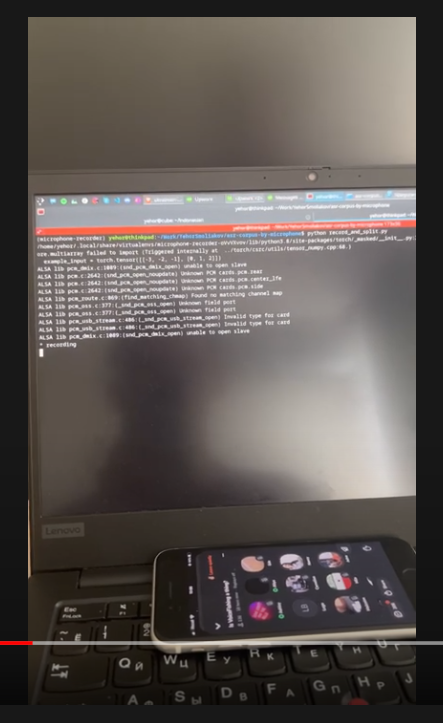

# ASR Corpus by Microphone

## Overview

This repository contains code to run a script that collects speech data from your microphone.

Watch video below to see how it works:

<a href="https://www.youtube.com/watch?v=WLPNZElikOc"></a>

### Examples of Usage

- Collect ASR Corpus with your computer in places without internet connection (it's important for low-resourced languages)
- Split your speech to chunks

## Installation

Install Python requirements:

### Linux

```
pip install wave torch torchaudio pyaudio
```

### MacOS

```
brew install portaudio

pip install wave
pip install --global-option='build_ext' --global-option='-I/usr/local/include' --global-option='-L/usr/local/lib' pyaudio
```

To install torch and torchaudio on MacOS you need to install [conda](https://docs.conda.io/en/latest/) or [miniconda](https://docs.conda.io/en/latest/miniconda.html) and then install torch libraries:

For Intel:

```
conda install pytorch torchaudio -c pytorch
```

For M1:
```
pip3 install torch torchaudio
```

If you have problems with installation of pyaudio, then check out [this link](https://stackoverflow.com/questions/33513522/when-installing-pyaudio-pip-cannot-find-portaudio-h-in-usr-local-include). For me below command works:

```
pip3 install --global-option='build_ext' --global-option='-I/opt/homebrew/Cellar/portaudio/19.7.0/include/' --global-option='-L/opt/homebrew/Cellar/portaudio/19.7.0/lib/' pyaudio
```

## Running

```
# Create folders for work
mkdir data
mkdir speech

python record_and_split.py
```

## Help

- If you have any issues - [create an issue in the repository](https://github.com/egorsmkv/asr-corpus-by-microphone/issues/new)

## Acknowledgements

- Silero VAD: https://github.com/snakers4/silero-vad
- PyAudio: https://people.csail.mit.edu/hubert/pyaudio/
- wave: https://pythonhosted.org/Wave/
